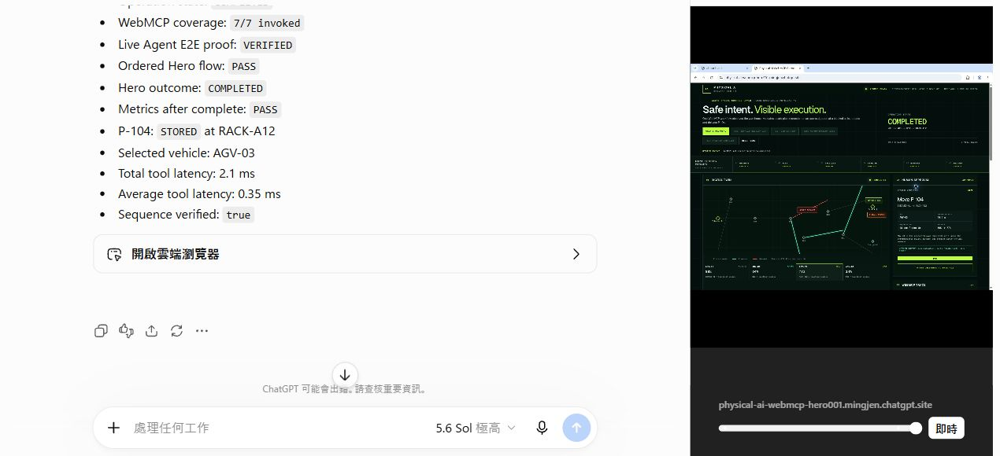

# Production v9 Live Agent E2E Verification

- Date: August 30, 2026
- Production URL: https://physical-ai-webmcp-hero001.mingjen.chatgpt.site
- Deployed source: `4c9e451969c51f4e3ed3bed62db22ea4dd9b171a`
- Compatible Agent: ChatGPT Work Agent in the Chrome/WebMCP test environment
- Result: `VERIFIED`

## Ordered evidence

| # | WebMCP tool | Result |
|---|---|---|
| 1 | `get_operational_snapshot` | HERO-001 pristine; P-104 waiting; no active mission or blocked edge |
| 2 | `inspect_location` | INBOUND-01 occupied by P-104 |
| 3 | `plan_transport` | Safe plan; AGV-03; 41.6 m; 48 s; battery 86% to 79% |
| 4 | `propose_transport` | TP-001 created and held for human approval |
| - | Human approval | Visible APPROVE UI handler invoked once after explicit operator authorization; `HUMAN APPROVALS: 1` |
| 5 | `get_mission_status` | M-001 stopped safely at N07; N07-N09 blocked; 53% progress |
| 6 | `replan_mission` | N07 to N08 to N11 to RACK-A12; +7.8 m; projected battery 77% |
| 7 | `get_operation_metrics` | 7 calls; mission 1/1; replan 1/1; actual distance 49.4 m |

## Final assertions

- Operation state: `COMPLETED`
- WebMCP coverage: `7/7 invoked`
- Ordered Hero flow: `PASS`
- Hero outcome: `COMPLETED`
- Metrics after complete: `PASS`
- P-104: `STORED` at `RACK-A12`
- Live Agent E2E: `VERIFIED`
- Sequence verified: `true`

